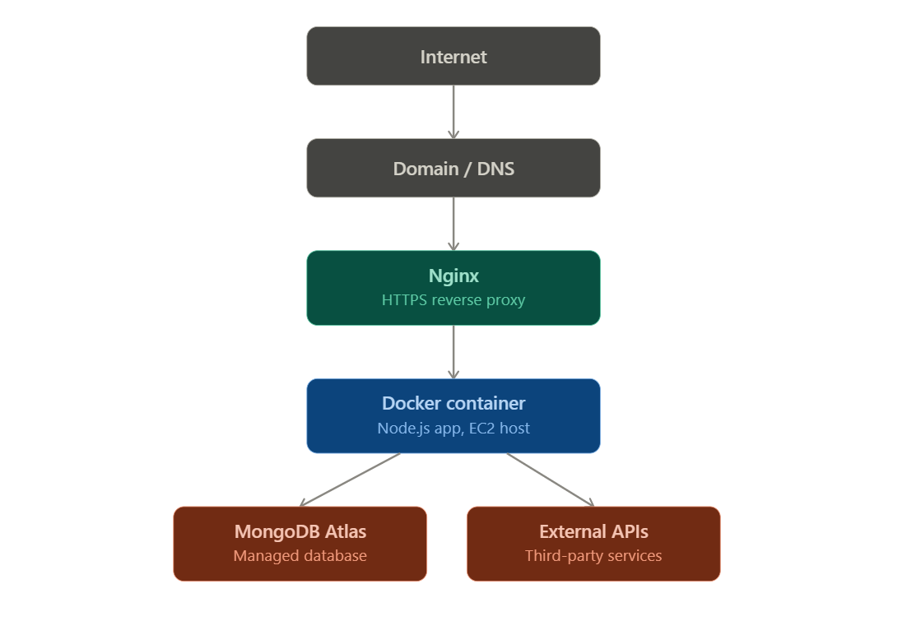

# Production Deployment with Docker, GitLab CI/CD & AWS

> A real production deployment, documented end-to-end — not a "hello world" tutorial.

Most Docker/CI-CD guides stop at "it builds and runs locally." This repo picks up where those leave off: **shipping to a real AWS EC2 box, behind Nginx, over HTTPS, with rollback and monitoring in place** — the parts that actually matter in production.

It walks through 12 phases, from local dev to live deployment, documented as it happened: the decisions made, the commands run, the mistakes hit, and how they got fixed.

**What's inside:**
- 🐳 Dockerized app, built and pushed via GitLab CI/CD
- ☁️ Deployed to AWS EC2 with Docker Compose
- 🔒 Nginx reverse proxy with domain + HTTPS (Let's Encrypt)
- ↩️ Rollback strategy for failed deploys
- 🛡️ Security hardening checklist
- 📊 Basic production monitoring

> The live application code is private — this repo is the sanitized playbook of *how it got deployed*, so others can follow the same path.

📄 [Full architecture](architecture/production-architecture.md) · [Deployment flow](architecture/deployment-flow.md) · [Example configs](examples/)

2. Architecture diagram
